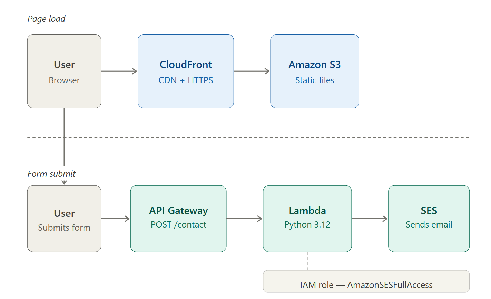
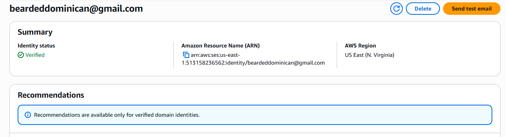
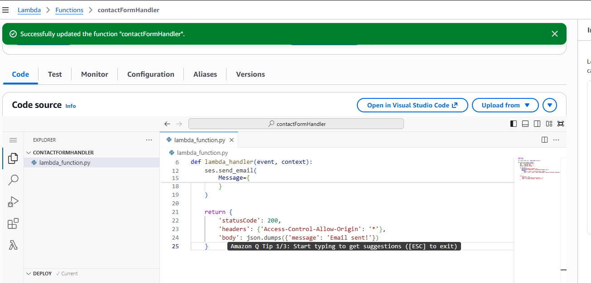
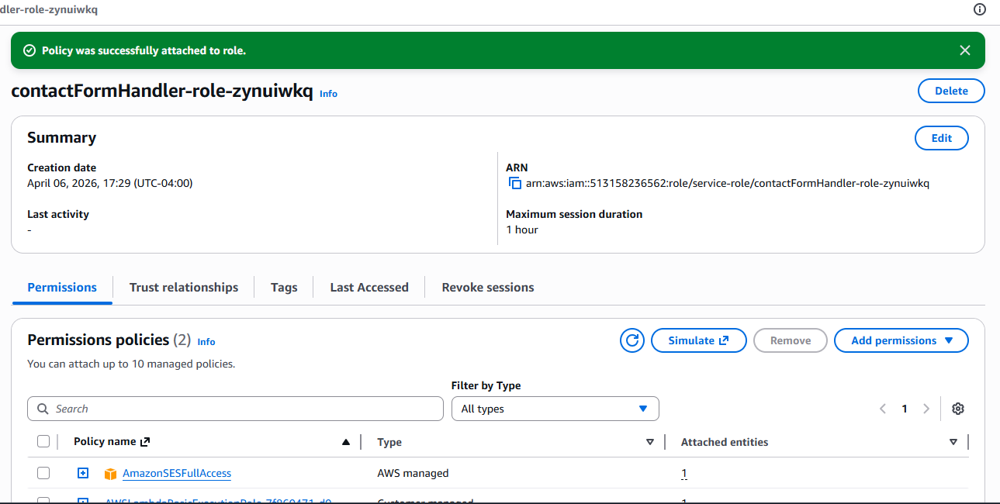
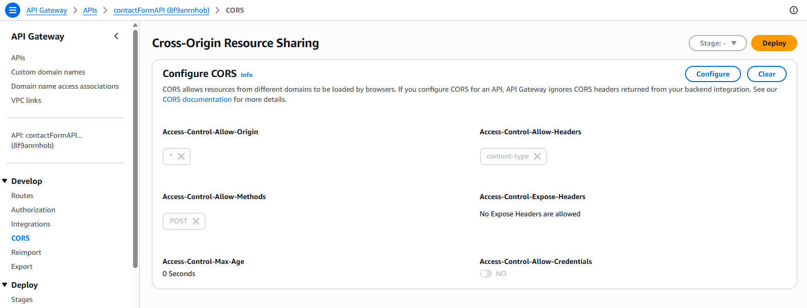
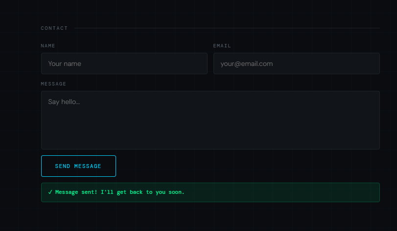
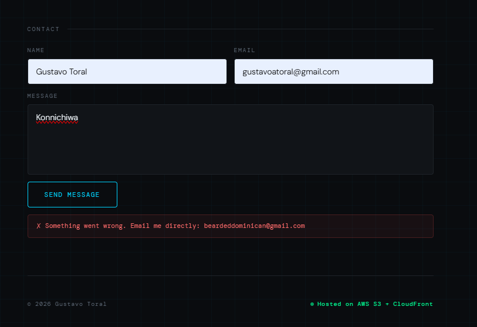
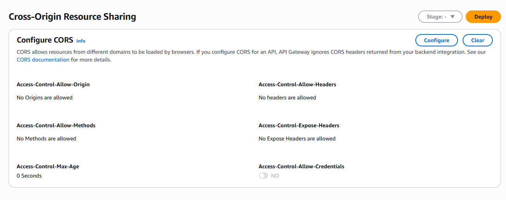

# Serverless Contact Form on AWS

A fully serverless contact form backend built with API Gateway, Lambda, and SES.
Integrated into a static portfolio site hosted on S3 + CloudFront.

🌐 **Live site:** https://d34h7plwugd541.cloudfront.net

---

## Architecture



---

## Services Used

| Service | Role |
|---|---|
| **API Gateway** | HTTP API exposing `POST /contact` |
| **Lambda** | Python 3.12 function that calls SES |
| **SES** | Sends email to verified recipient |
| **IAM** | Execution role with `AmazonSESFullAccess` |
| **S3 + CloudFront** | Hosts the frontend (see static-website project) |

---

## Implementation

**1. Verified sender email in SES**



**2. Created Lambda function**



```python
import json
import boto3

ses = boto3.client('ses', region_name='us-east-1')

def lambda_handler(event, context):
    body = json.loads(event['body'])
    name    = body.get('name', '')
    email   = body.get('email', '')
    message = body.get('message', '')

    ses.send_email(
        Source='beardeddominican@gmail.com',
        Destination={'ToAddresses': ['beardeddominican@gmail.com']},
        Message={
            'Subject': {'Data': f'Portfolio Contact: {name}'},
            'Body': {'Text': {'Data': f'Name: {name}\nEmail: {email}\n\nMessage:\n{message}'}}
        }
    )

    return {
        'statusCode': 200,
        'headers': {'Access-Control-Allow-Origin': '*'},
        'body': json.dumps({'message': 'Email sent!'})
    }
```

**3. Attached IAM policy to Lambda execution role**



**4. Created HTTP API in API Gateway with `POST /contact` route**


**5. Configured CORS**



**6. Wired contact form in `index.html` to POST to the API endpoint**



---

## Challenges & Lessons Learned

**CORS error on form submit**

Browser was blocking the API response because API Gateway wasn't returning CORS headers.




Fixed by configuring CORS on the HTTP API (`Allow-Origin: *`, `Allow-Headers: content-type`, `Allow-Methods: POST`). Note: API Gateway-level CORS overrides any headers returned by Lambda — the Lambda headers are redundant but kept for clarity.

**CloudFront Distribution ID vs domain name**

`create-invalidation` requires the Distribution ID (e.g. `EWQ0L2AO5RDW9`), not the CloudFront domain name. Using the domain returns an error.

**SES sandbox mode**

By default SES only sends to verified addresses. Production use requires requesting SES production access.

---

## Deployment

Updates deployed from AWS CloudShell with a single command:

```bash
aws s3 cp index.html s3://gt-portfolio-2026/index.html && \
aws cloudfront create-invalidation --distribution-id EWQ0L2AO5RDW9 --paths "/*"
```

---

## Region

All services deployed in `us-east-1` (N. Virginia).
