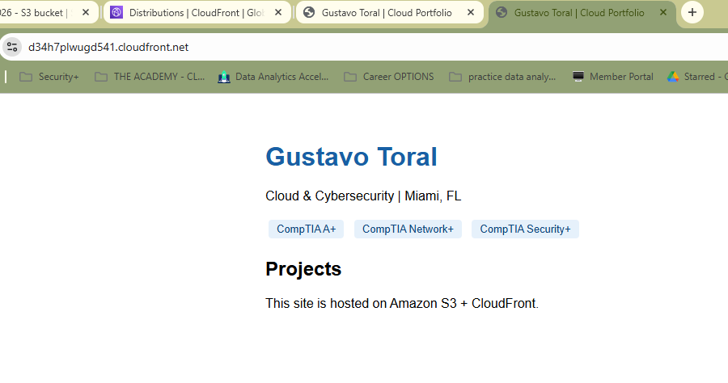
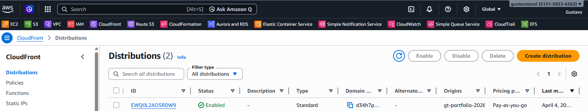
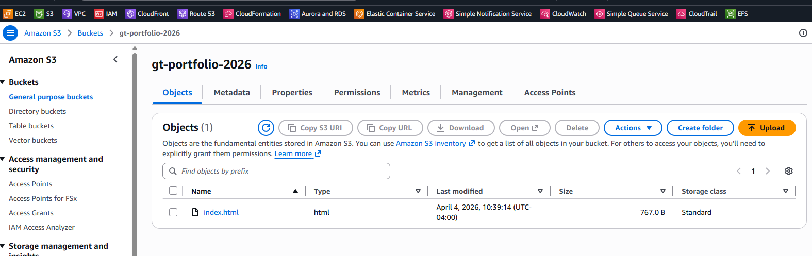

# Static Website Hosting on AWS

A personal portfolio site deployed on Amazon S3 and served globally 
via CloudFront CDN with HTTPS. Built as a hands-on AWS Cloud Practitioner 
exam project.

🌐 **Live site:** https://d34h7plwugd541.cloudfront.net

---

## Architecture

User → CloudFront (HTTPS + CDN) → S3 Bucket (static files)

---

## Services Used

- **Amazon S3** — stores and serves the static HTML/CSS files
- **CloudFront** — global CDN, HTTPS termination, edge caching
- **IAM** — bucket policy granting public read access via `s3:GetObject`

---

## Implementation

1. Created S3 bucket with static website hosting enabled
2. Uploaded `index.html` and configured public bucket policy
3. Created CloudFront distribution pointing to S3 website endpoint
4. Configured default root object and HTTP→HTTPS redirect

---

## Challenges & Lessons Learned

**504 Gateway Timeout on CloudFront** — Initially pointed CloudFront 
to the S3 REST endpoint instead of the S3 website endpoint. Fixed by 
manually entering the website endpoint URL and setting protocol to 
HTTP only (CloudFront handles HTTPS to the viewer).

**Blank default root object** — CloudFront returned errors at the root 
path until I set the default root object to `index.html` in the 
distribution settings. S3 handles this automatically via static hosting 
config, but CloudFront requires it to be set separately.

---

## Screenshots

